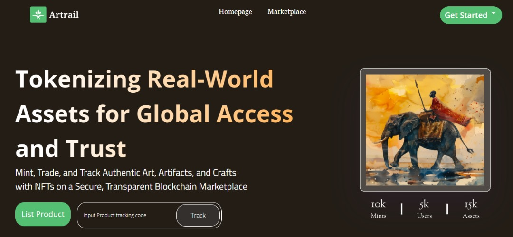

# Artrail

## Product Vision:
 To revolutionize the ownership and trading of real-world assets by transforming them into unique, traceable digital assets (NFTs) on the blockchain.

## Product Overview
Artrail is a blockchain-based platform that allows real-world asset (RWA) tokenization through NFTs. Artists, artisans, artifact creators, or sellers can list their real-world products as NFTs by providing key details like product description, origin, quantity, and price. Each product created on Artrail generates a unique code for tracking of products, the NFT generated is transferable to only one buyer at a time, ensuring transparency and authenticity.
Buyers on Artrail can purchase, track, claim, and resell these NFTs in a transparent marketplace. Once the physical asset is delivered, buyers can claim the NFT, resell it on the secondary market, or keep it as a digital collectible.

## Problem Statement
The global market for real-world assets (art, artifacts, crafts, etc.) faces challenges with authenticity, traceability, and fraud. Artists, Artisans and other art sellers in developing regions often struggle to reach a global marketplace, limiting their earning potential. Collectors and buyers also lack transparency and trust when purchasing high-value items, as it is difficult to verify provenance. Buyers may struggle with verifying the legitimacy and tracking the history of purchased assets. 
Artrail solves these issues by enabling secure tokenization of real-world assets (RWA) and transparent tracking through NFTs. It enables artists, creators, and sellers to tokenize their assets, making them verifiable, traceable, and globally accessible through NFTs. Buyers can rest assured of the authenticity of their purchases while benefiting from the security of blockchain technology. The platform leverages NFTs to provide verifiable provenance, simplify the buying process, and facilitate secondary sales, ensuring that both physical and digital aspects of the asset are securely handled.

## Target Audience
Creators/Artisans/Artists/Sellers
Individuals or businesses that create or sell unique, valuable physical items, such as artwork, handcrafted goods, artifacts etc.
Buyers/Collectors/Investors
Individuals interested in purchasing rare, authentic items with full transparency into the product’s origin and history.
Secondary Market Enthusiasts
Buyers and sellers who wish to engage in NFT-based resales of physical goods.

## User Profiles
Creator/Artist/Artisan profile: Allows creators to manage their store,  their listings, create and list new a product which in turn generate a NFT, and communicate with the buyer on product status.
Buyer profile: Provides buyers with purchase ability, minting and claim of NFTs, purchase history, and the ability to manage or resell NFTs.
Key Features:


## Tokenization of RWAs as NFTs
 - Store creation and management 


 - Product Listing and NFTs creation


 - Unique NFT Code identifier


 - Marketplace 

 - Product purchase and NFTs minting 


 - Chat/Communication 


 - NFT tracking and ownership verification


 - NFT secondary market


 - RWA claiming.

## Screenshots

- 1




## Details of Features and Functionality
 - 1. User Role: Creators/Sellers such as Artist, artisan, artifact
     - a.  Store creation and management 
Sellers can create stores with details like (Store Name and the store Location)
     - b. RWA Product Listing/ NFT generation for RWA
      Function: List real-world assets as product by inputting details:
Product Name/title 
Image 
Product description (type, material, history)
Origin and location (country, region)
Quantity (units available)
Price per quantity (in cryptocurrency).
NFT is created for each successful listed product.
Unique NFT Code/QR Code: A unique identifier is generated for each listed product NFT to enable tracking, ownership history, and authentication.
 - 2. NFT Transfer & Ownership
One Buyer at a Time: NFTs minted for RWAs can only be transferred to one buyer at a time, ensuring single ownership per asset.
Upon purchase and claims (asset delivery), the NFT is bound to the buyer until it resold.
Ownership Verification: Buyers can verify the authenticity of the NFT and its underlying real-world asset through unique NFT code blockchain records.
 - 3. Marketplace Search & Discovery
Buyers can view all the listed products on the Artrail marketplace
Buyers can search for products by keywords, category, or location.
Buyers can select a product and view the showcased detailed product information, including price, origin, and ownership history.
Buyers can purchase products using cryptocurrency.
Upon purchase,  NFT tied to the real-world asset is minted to the buyers
Buyers can view or access the product code for tracking.
Note that payment is held in the escrow until the buyer claims the NFT after the item receipt.
 - 4. Communication Feature and Status update: 
Communication/Chat feature between the buyers and the sellers for delivery information Note: Only wallet addresses used in purchasing assets should be used in the communication of delivery information to the seller. Sellers and buyers should be duly notified of this. In addition, for pickup delivery, presentation of NFT for assets claimed 
 - 5. Tracking & Claiming RWAs
RWA Tracking: After purchasing the product, the buyer can access and claim the minted NFT using the Product’s unique code.
Claiming Process
Upon receiving the physical asset, buyers can confirm asset receipt and claim ownership through the platform.
The claim process transfers the final ownership rights of the NFT (RWA) to the buyer.
Note that the Payment gets released from the escrow to the seller after the NFT claims.
 - 6. Secondary Market for Reselling NFTs
Buyers can resell NFTs on Artrail’s secondary marketplace, allowing the buyers to input the new price for resale.
Resale includes the transfer of NFT and associated RWA tracking rights to the new buyer.
The unique code ensures only one buyer holds ownership at a time, transferring ownership upon each sale.

 ## Conclusion
Artrail is positioned to revolutionize how real-world assets are bought, sold, and resold through NFTs. It leverages blockchain technology to bridge the gap between the physical and digital worlds by providing artists, artisans, collectors etc with a secure, transparent, and efficient platform for tokenizing, tracking, and trading real-world assets as NFTs. The platform enhances trust and opens up new opportunities for creators and collectors in a decentralized ecosystem.

## Resources

```bash
PRD
https://docs.google.com/document/d/19tNmADE0ugmT41oxMytSqw8gkfjbNnkr48zjnW2c68Q/edit?usp=sharing 
Design
https://www.figma.com/design/d9uCM2h3gBmEJh61Fi8CJt/Artrail?node-id=0-1&node-type=canvas&t=c6tvNhKFFP3WKfNS-0 

```

```bash
Pitch: https://www.canva.com/design/DAGU9-Tx2tM/lE1gdamoECv028SJGONvHQ/edit?utm_content=DAGU9-Tx2tM&utm_campaign=designshare&utm_medium=link2&utm_source=sharebutton

```

`Deployed and verified on Polygon Amoy`
`Artrail deployed to: 0x1f8B55D6b85b42bDBcc4f183656e0C01A93Dbf40`
`Creator account created for: 0x311350f1c7Ba0F1749572Cc8A948Dd7f9aF1f42a`
`Store added: 0x311350f1c7Ba0F1749572Cc8A948Dd7f9aF1f42a`

 Demo:
